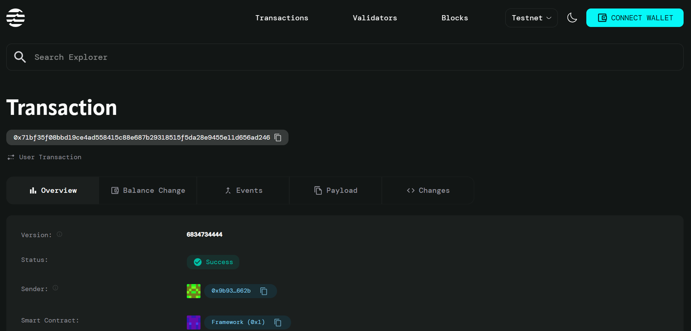

# Automated Treasury Operations and Fund Allocation

## Project Description

This smart contract provides automated treasury management and fund allocation on the Aptos blockchain. The system automatically distributes incoming funds according to predefined allocation percentages, ensuring consistent and transparent treasury operations. Organizations can set up their treasury with specific allocation rules for operations and reserves, and all deposits are automatically distributed according to these rules without manual intervention.

## Project Vision

To revolutionize treasury management for DAOs, organizations, and projects by providing a fully automated, transparent, and efficient fund allocation system. Our vision is to eliminate manual treasury operations, reduce human error, and ensure consistent financial management through blockchain automation. This system aims to become the standard for decentralized treasury operations, enabling organizations to focus on their core activities while maintaining optimal financial allocation.

## Key Features

- **Automated Fund Allocation**: Automatically distributes deposits according to predefined percentage allocations
- **Treasury Initialization**: Set up treasury with custom allocation percentages for operations and reserves
- **Real-time Tracking**: Track total balance and allocated amounts for different categories
- **Decentralized**: Built on Aptos blockchain for transparency and security
- **Token Integration**: Utilizes AptosCoin for seamless transactions
- **Percentage-based Distribution**: Flexible allocation system using percentage-based rules
- **Error Handling**: Built-in validation for allocation percentages and fund availability

## Future Scope

- **Multi-Category Allocation**: Expand beyond operations and reserves to include marketing, development, and community funds
- **Time-based Releases**: Implement vesting schedules and time-locked fund releases
- **Governance Integration**: Add voting mechanisms for changing allocation percentages
- **Advanced Analytics**: Provide detailed treasury analytics and reporting dashboards
- **Multi-token Support**: Support for various token types beyond AptosCoin
- **Emergency Controls**: Add pause/unpause functionality and emergency withdrawal mechanisms
- **Integration APIs**: Develop APIs for easy integration with existing financial systems
- **Mobile Treasury App**: Create mobile applications for treasury monitoring and management
- **Cross-chain Compatibility**: Extend treasury operations across multiple blockchain networks
- **AI-driven Optimization**: Implement machine learning for optimal allocation strategies


## Getting Started

### Prerequisites
- Aptos CLI installed
- Move development environment set up
- AptosCoin testnet tokens for testing

### Installation
1. Clone this repository
2. Navigate to the project directory
3. Compile the contract: `aptos move compile`
4. Deploy to testnet: `aptos move publish`

### Usage Examples

#### Initialize Treasury
```move
// Initialize treasury with 70% operations, 30% reserves
initialize_treasury(signer, 70, 30);
```

#### Deposit and Auto-allocate Funds
```move
// Deposit 1000 tokens - automatically allocates 700 to operations, 300 to reserves
deposit_and_allocate(depositor, treasury_address, 1000);
```

## Contract details
0x71bf35f08bbd19ce4ad558415c88e687b29318515f5da28e9455e11d656ad246


## Contract Functions

1. **initialize_treasury**: Sets up treasury with allocation percentages
2. **deposit_and_allocate**: Deposits funds and automatically allocates them based on predefined rules

## Contributing

Contributions are welcome! Please feel free to submit a Pull Request.

## License

[Add your preferred license here]